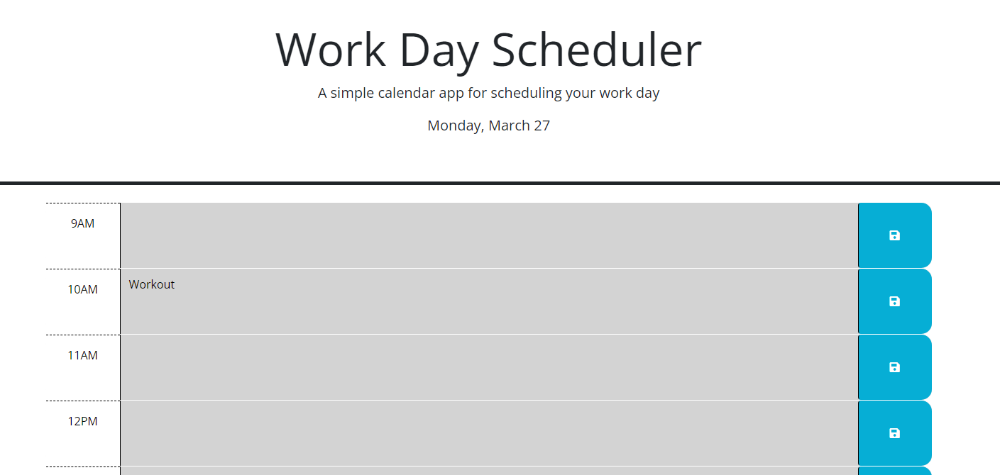

# Work Day Scheduler
Module 5 Challenge

## Description

This is a simple calendar application that allows a user to save events for each hour of the day. This app runs in the browser and features dynamically updated HTML and CSS powered by JQuery. The application also uses Day.js to display the current date and current hour (within the 9-5pm work day). 

## Deployed Application

Here is the link to the deployed application [https://jmcconna.github.io/Work-Day-Scheduler/]

